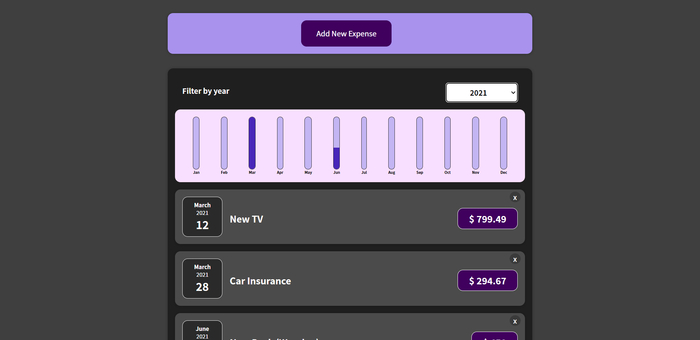

# Expense-Tracker

## Description

This app helps you manage your money on the go. By understanding what you spend money on and how much you spend, you can see exactly where your cash is going.
Build with React.js

## Live Demo 🌐

**You Can See The `Mapp` Live On:** [Here](https://expenses-tracker-reactjs-v1.netlify.app/)

## :rocket: Technologies used:

## Additional Used
-  [x] NPM
-  [x] ES6 (Modules)

You can use any tools you like to help you complete the challenge. So if you've got something you'd like to practice, feel free to give it a go.

> ✅ **Feel Free To Fork and Contribute**

---

## ⭐ Features

-  [x] Add new expenses
-  [x] Delete Expenses
-  [x] Track your expenses
-  [x] Responsive design

## Getting Started

To get a local copy up and running follow these simple example steps.

`git clone https://github.com/HamedOsama/Expense-Tracker.git`

Then `cd Expense-tracker-app`

Then `npm install` to install packages

Finally `npm start`
## Authors

Developed by **Hamed Osama**

## Contact

-   Gmail: **[`hamedosama19@gmail.com`]**
-   **[LinkedIN](https://www.linkedin.com/in/hamed-osama-70b838206/)**
